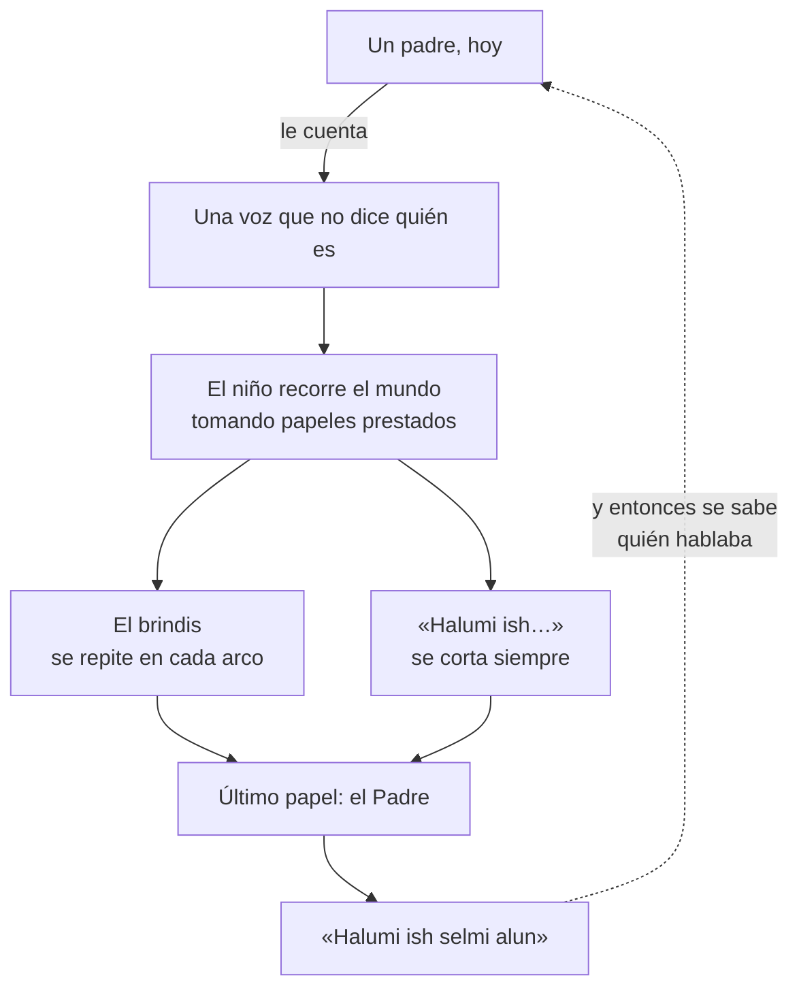
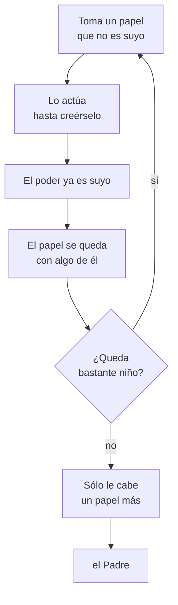

# La forma que podría tener el libro

> Boceto del 2 de agosto de 2026. Nada de esto está cerrado: es **una** de las
> historias posibles con lo que ya has decidido, la que sale de elegir las opciones
> recomendadas en [[boceto]]. Sirve para discutirla, no para obedecerla.
>
> Versión con dibujos: la publiqué aparte para verla en el móvil.

---

## I · La arquitectura

Todo el libro es un círculo. Empieza en un padre que cuenta y termina volviendo a él
— y sólo entonces se entiende quién estaba hablando desde la primera página.

La flecha de puntos es lo único que el lector no ve venir. Es la última página.

---

## II · El viaje

Seis arcos para el libro uno. Cada lugar lleva **un tema** —nunca dos— y **un papel**
que el niño toma para poder cruzarlo.

| # | Lugar | Tema | Papel | Grado |
|---|---|---|---|---|
| 1 | El pueblo | Perder a alguien, y que no vuelva | el Huérfano | **0** · Yerma |
| 2 | La escuela flotante | No encajar. Hacer reír para que no te peguen | el Payaso | **1** · Doméstica |
| 3 | La ciudad-jardín | Lo bonito, y lo que hubo que talar y matar | el Jardinero | **2** · Artesana |
| 4 | El barrio bajo | Mafia y adicción. Gente que no eligió estar ahí | el Ladrón | **3** · Industrial |
| 5 | El conservatorio | Alguien toca a mano en una ciudad que ya no lo necesita | el Músico | **4** · Saturada |
| 6 | Casa | Seguir vivo. Y decir la frase entera | **el Padre** | **0** · Yerma |

**El viaje sube de 0 a 4 y vuelve a 0.** Lo que importa al final no está enchufado a
nada — y eso no hay que explicarlo, se ve en el mapa.

En el arco 5 es donde el niño **no puede ayudar**. Es la escena que exige la cuarta
línea del brindis; sin ella, «ayuda siempre que puedas» es un adorno.

---

## III · El sistema, y por qué duele

Ganar poder es fingir ser otro hasta creértelo. Y cada papel se queda con algo.
Es un niño haciéndose adulto, escrito como mecánica.

Quien lo persigue por hacer esto **tiene razón**: sin control, cualquiera se queda con
la vida de otro. El niño es ilegal sin saberlo.

---

## IV · Lo que sigue sin decidirse

El dibujo da por elegidas estas cinco. Cambiar cualquiera cambia el diagrama entero,
y por eso están aquí y no escondidas.

| | Decisión |
|---|---|
| **A** | **Papeles** como sistema, frente a nombres prestados o herencias |
| **B** | **Narrador que no se identifica**, frente a un padre declarado desde la página uno |
| **C** | **La institución que administra los papeles** como antagonista |
| **E** | **Seis arcos** y libro cerrado, frente a saga larga |
| **F** | **De qué se alimenta la tecnología mágica.** Si es de vidas prestadas, todo se ata en una sola idea |

---

> ### `Halumi ish selmi alun.`
> *Mi sueño es que mi hijo sea feliz.*
